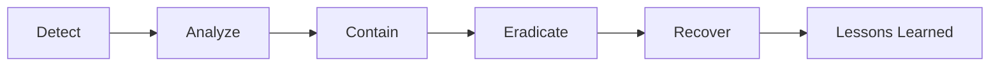

# Security Principles and Best Practices

Core security principles that form the foundation of secure software development and system administration.

## Core Security Principles

### 1. Principle of Least Privilege (PoLP)

Users, applications, and processes should only have the minimum permissions necessary to perform their required tasks.

**Key Implementation Strategies:**
- Grant permissions on a need-to-have basis, not nice-to-have
- Regularly audit and revoke unnecessary permissions
- Use role-based access control (RBAC)
- Implement just-in-time (JIT) access for elevated privileges

**Examples:**
```bash
# Bad: Running services as root
sudo node server.js

# Good: Running services as dedicated user
sudo -u appuser node server.js
```

```sql
-- Bad: Granting all privileges
GRANT ALL PRIVILEGES ON database.* TO 'user'@'localhost';

-- Good: Granting specific required privileges
GRANT SELECT, INSERT, UPDATE ON database.table TO 'user'@'localhost';
```

### 2. Defense in Depth

Implement multiple layers of security controls to protect against threats. If one layer fails, others continue to provide protection.

**Security Layers:**
- Network security (firewalls, segmentation)
- Application security (input validation, authentication)
- Data security (encryption at rest and in transit)
- Physical security (access controls, monitoring)
- Administrative security (policies, training)

**Example Implementation:**
```yaml
# Multiple security layers for a web application
layers:
  - WAF (Web Application Firewall)
  - Rate limiting
  - Input validation
  - Authentication & authorization
  - Encryption (TLS/SSL)
  - Database encryption
  - Audit logging
  - Monitoring & alerting
```

### 3. Zero Trust Architecture

Never trust, always verify. Assume no implicit trust based on network location or previous authentication.

**Core Principles:**
- Verify explicitly (authenticate and authorize every request)
- Use least privilege access
- Assume breach (minimize blast radius)

**Implementation:**
```javascript
// Every API request requires authentication
app.use('/api/*', authenticateToken);
app.use('/api/*', authorizeRequest);
app.use('/api/*', validateInput);
app.use('/api/*', auditLog);
```

### 4. Fail Secure (Fail Closed)

When a system fails, it should default to a secure state that denies access rather than granting it.

**Examples:**
```python
def authorize_user(user_id, resource):
    try:
        permissions = get_user_permissions(user_id)
        return check_permission(permissions, resource)
    except Exception as e:
        # Fail secure - deny access on error
        log_error(f"Authorization error: {e}")
        return False  # Deny by default
```

### 5. Separation of Duties

Critical tasks should require multiple people or systems to complete, preventing single points of compromise.

**Implementation Areas:**
- Code review requirements before production deployment
- Multi-signature requirements for financial transactions
- Separate development, staging, and production environments
- Split knowledge of encryption keys

### 6. Security by Design

Integrate security considerations from the beginning of the development lifecycle, not as an afterthought.

**Key Practices:**
- Threat modeling during design phase
- Security requirements in user stories
- Secure coding standards
- Security testing in CI/CD pipeline

## Common Security Anti-Patterns to Avoid

### 1. Security Through Obscurity
Relying solely on secrecy of implementation rather than robust security controls.

```bash
# Bad: Hidden endpoint as only security
/api/secret-admin-panel-2024

# Good: Properly secured endpoint
/api/admin  # With authentication, authorization, and audit logging
```

### 2. Hardcoded Secrets
```javascript
// Bad: Hardcoded credentials
const apiKey = "sk-1234567890abcdef";

// Good: Environment variables with secret management
const apiKey = process.env.API_KEY;
```

### 3. Overly Permissive CORS
```javascript
// Bad: Allow all origins
app.use(cors({ origin: '*' }));

// Good: Specific allowed origins
app.use(cors({ 
  origin: ['https://trusted-domain.com'],
  credentials: true 
}));
```

## Security Checklist

### Authentication & Authorization
- [ ] Multi-factor authentication (MFA) implemented
- [ ] Session management with secure tokens
- [ ] Password complexity requirements
- [ ] Account lockout mechanisms
- [ ] Role-based access control (RBAC)

### Data Protection
- [ ] Encryption at rest for sensitive data
- [ ] TLS/SSL for data in transit
- [ ] Secure key management
- [ ] Data classification and handling policies
- [ ] Regular data backups with encryption

### Input Validation & Output Encoding
- [ ] Input validation on all user inputs
- [ ] Parameterized queries to prevent SQL injection
- [ ] Output encoding to prevent XSS
- [ ] File upload restrictions and scanning
- [ ] Rate limiting on APIs

### Security Monitoring
- [ ] Centralized logging
- [ ] Security event monitoring
- [ ] Intrusion detection systems
- [ ] Regular security audits
- [ ] Incident response plan

### Dependency Management
- [ ] Regular dependency updates
- [ ] Vulnerability scanning in CI/CD
- [ ] Software composition analysis
- [ ] License compliance checks

## Implementing Security in DevOps (DevSecOps)

### CI/CD Pipeline Security
```yaml
# Example GitLab CI security pipeline
stages:
  - build
  - test
  - security
  - deploy

security-scan:
  stage: security
  script:
    - npm audit
    - docker scan myimage:latest
    - trivy image myimage:latest
    - sonarqube-scan
```

### Infrastructure as Code Security
```hcl
# Terraform security scanning
resource "aws_s3_bucket" "data" {
  bucket = "my-secure-bucket"
  
  # Encryption by default
  server_side_encryption_configuration {
    rule {
      apply_server_side_encryption_by_default {
        sse_algorithm = "AES256"
      }
    }
  }
  
  # Block public access
  public_access_block {
    block_public_acls       = true
    block_public_policy     = true
    ignore_public_acls      = true
    restrict_public_buckets = true
  }
}
```

## Security Resources and Standards

### Industry Standards
- **OWASP Top 10**: Web application security risks
- **CIS Controls**: Prioritized cybersecurity best practices
- **NIST Cybersecurity Framework**: Risk management framework
- **ISO 27001/27002**: Information security management standards
- **PCI DSS**: Payment card industry security standards

### Security Tools
- **Static Analysis**: SonarQube, Checkmarx, Fortify
- **Dynamic Analysis**: OWASP ZAP, Burp Suite
- **Dependency Scanning**: Snyk, WhiteSource, Dependabot
- **Container Security**: Trivy, Clair, Anchore
- **Secret Scanning**: GitLeaks, TruffleHog

### Continuous Learning
- Security training and awareness programs
- Regular penetration testing
- Bug bounty programs
- Security champions within development teams
- Participation in security communities

## Incident Response

### Preparation Phase
1. Establish incident response team
2. Define incident classification levels
3. Create communication protocols
4. Maintain incident response toolkit

### Response Workflow


Remember: Security is not a destination but a continuous journey of improvement and vigilance.
